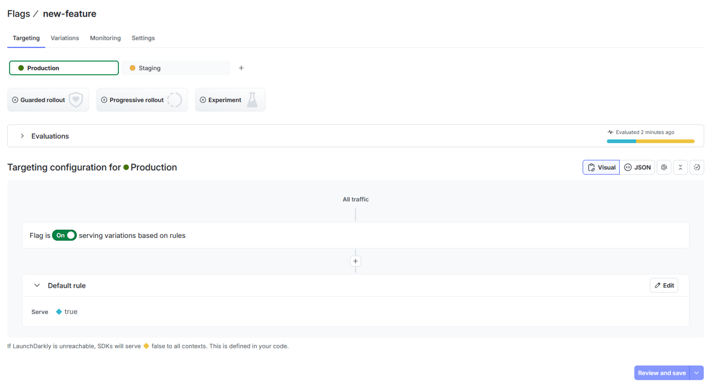
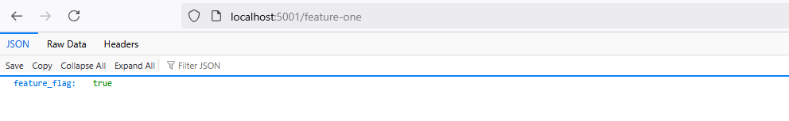
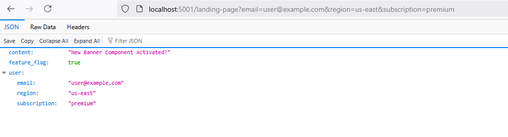
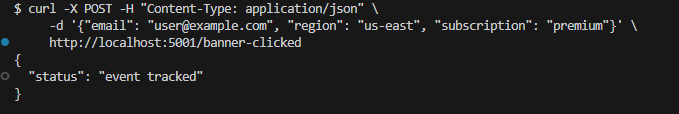

# LaunchDarkly Sample App

This sample application demonstrates the use of LaunchDarkly feature flags in Python using Flask. It covers three key scenarios: **Release/Remediate**, **Target**, and **Experimentation**.

## Scenarios Covered

* **Release/Remediate**: Quickly release and roll back a feature flag.
* **Target**: Demonstrate feature targeting based on user context attributes.
* **Experimentation**: Track user interactions to measure feature impact.

---

## Prerequisites

* Python 3.8 or higher
* Flask
* LaunchDarkly Server-Side SDK for Python

## Installation

1. **Clone this repository**:

   ```bash
   git clone https://github.com/SaigMike/LaunchDarkly.git
   cd LaunchDarkly
   ```

2. **Install dependencies**:

   ```bash
   pip install flask launchdarkly-server-sdk python-dotenv
   ```

---

## Configuration

### Local Environment Setup

Create a `.env` file at the project root and securely set your LaunchDarkly SDK key:

```bash
LD_SDK_KEY=your-sdk-key-here
```

Replace `your-sdk-key-here` with your actual LaunchDarkly SDK key.

### LaunchDarkly Website Configuration

Complete the following detailed steps to configure LaunchDarkly to work with this application:

1. **Create a LaunchDarkly Account and Project**

   * Sign up at [LaunchDarkly](https://app.launchdarkly.com/signup/) if you don't already have an account.
   

   * Create a new project specifically for the three scenarios, naming it to reflect its purpose.
   

2. **Create Feature Flags**

   * Navigate to your project and create the following feature flags:

     * `new-feature`:

       * Used in the **Release/Remediate** scenario.
       

       * [LaunchDarkly Docs: Creating Feature Flags](https://launchdarkly.com/docs/home/flags/create)
     * `landing-page-banner`:

       * Used in the **Target** and **Experimentation** scenarios.
       * [LaunchDarkly Docs: Creating Feature Flags](https://launchdarkly.com/docs/home/flags/create)

3. **Configure Targeting Rules and Segments**

   * Set up context-based targeting:

     * Go to the feature flag `landing-page-banner`.
     * Configure individual or rule-based targeting using context attributes such as `region`, `subscription`, and `email`.
     

     * Refer to the following documentation for detailed guidance:

       * [LaunchDarkly Docs: Targets](https://launchdarkly.com/docs/home/flags/target)
       * [LaunchDarkly Docs: Segments](https://launchdarkly.com/docs/home/flags/segments)

4. **Experimentation Setup**

   * Define a metric for measuring user interaction, such as "banner clicks".
   

   * Follow instructions at [Metrics](https://launchdarkly.com/docs/home/metrics).
   * Create an experiment using the `landing-page-banner` feature flag and the defined metric to measure its impact.
   
   * Configure the experiment: Feature change experiment type; randomized by user; Banner Button Click Count metric; landing-page-banner flag; 5% sample size; and 95% Bayesian threshold.
   
   
   

     * [LaunchDarkly Docs: Experimentation](https://launchdarkly.com/docs/home/experimentation).

---

## Running the Application

1. **Start the Flask application**:

   ```bash
   flask run --host=127.0.0.1 --port=5000
   ```

2. **Testing Endpoints**:

   * **Release/Remediate Scenario**:

     Access the endpoint:

     ```
     http://localhost:5000/feature-one
     ```
    
    
    


   * **Target Scenario**:

     Access the endpoint:

     ```
     http://localhost:5000/landing-page?email=user@example.com&region=us-east&subscription=premium
     ```
    


   * **Experimentation Scenario**:

     Execute the following curl command to simulate tracking user interactions:

     ```bash
     curl -X POST -H "Content-Type: application/json" \
     -d '{"email": "user@example.com", "region": "us-east", "subscription": "premium"}' \
     http://localhost:5000/banner-clicked
     ```
    


---

## Project Structure

```
.
├── .env                  # Contains sensitive environment variables (not committed)
├── saas-app.py           # Flask application with LaunchDarkly integration
├── requirements.txt      # Python dependencies
└── README.md             # Documentation
```

---

## Best Practices

* Use environment variables to securely manage sensitive information like SDK keys.
* Ensure feature flags are appropriately named and maintained in LaunchDarkly.
* Regularly monitor and test feature flags for expected behavior.
* Utilize detailed logging and error handling to simplify debugging and operations.

---

## Additional Resources

* [LaunchDarkly Docs:](https://docs.launchdarkly.com/)

---

## Support

For issues or further assistance, please open an issue on this repository.
