# LaunchDarkly Sample App

This Flask-based sample application showcases how to effectively integrate and utilize LaunchDarkly feature flags to manage and optimize software delivery. The application illustrates practical implementation across three critical DevOps scenarios:

  1. **Release and Remediate**: Safely release new features by instantly toggling them on or off, enabling rapid rollbacks with minimal impact to users.
  2. **Target**: Precisely deliver features based on specific user attributes and contextual data, enhancing user experience through targeted deployments.
  3. **Experimentation**: Measure user engagement and feature effectiveness through interaction tracking, empowering data-driven decision-making.

Each scenario highlights essential capabilities of LaunchDarkly, demonstrating the platform's versatility in managing feature lifecycles, user targeting, and experimentation in real-world applications.

---

## Directory Structure

The repository is structured as follows:

```
.
├─ .env                  # Environment variables (securely stored, not committed)
├─ .git                  # Git version control metadata
├─ .github               # GitHub Actions workflows for CI/CD
│  └─ workflows
│     └─ python-ci.yml   # Configuration for automated testing via GitHub Actions
├─ .gitignore            # Specifies files/directories ignored by Git
├─ images                # Documentation-related images
├─ README.md             # Documentation and project overview
├─ requirements.txt      # Python dependencies
├─ saas-app.py           # Main Flask application integrating LaunchDarkly
├─ static                # Static assets (CSS, images, JavaScript)
│  ├─ css
│  │  └─ saas-app.css    # Stylesheet for the application
│  ├─ images             # Static images
│  └─ js                 # JavaScript files for scenarios
│     ├─ scenario1.js    # JavaScript for Scenario 1
│     ├─ scenario2.js    # JavaScript for Scenario 2
│     └─ scenario3.js    # JavaScript for Scenario 3
├─ templates             # HTML templates for Flask routes
│  ├─ base.html          # Base template
│  ├─ index.html         # Homepage template
│  ├─ menu.html          # Navigation menu
│  ├─ scenario1.html     # Template for Scenario 1
│  ├─ scenario2.html     # Template for Scenario 2
│  └─ scenario3.html     # Template for Scenario 3
├─ tests                 # Unit tests
│  └─ test_app.py        # Test cases for application scenarios
├─ tree.txt              # Directory structure overview
└─ upload                # Directory for file uploads
```

---

## Prerequisites
You will need an active LaunchDarkly account to create feature flags and experiments. See Installation Part 2 for instructions for creating a LaunchDark.

You also need to ensure you have the following prerequisites installed on your local machine:

  * Python 3.8 or higher

Install the following Python libraries:

  * flask - Lightweight web application framework.
  * launchdarkly-server-sdk - SDK for integrating LaunchDarkly feature flags.
  * python-dotenv - For managing environment variables securely.
  * pytest - Testing framework for Python applications.
  * requests - For making HTTP requests.

You can install these dependencies using the provided requirements.txt:

  ```
  pip install -r requirements.txt
  ```

---

## Installation Part 1: Local Environment Setup
Follow these steps to install and set up the application locally:

  1. **Clone this repository**

  ```
  git clone https://github.com/SaigMike/LaunchDarkly.git
  cd LaunchDarkly
  ```

  2. **Set up a virtual environment (optional but recommended):**

  ```
  python -m venv venv
  source venv/bin/activate  # On Windows: venv\Scripts\activate
  ```

  3. **Install dependencies:**

  ```
  pip install -r requirements.txt
  ```

  4. **Configure environment variables:**

  * Create a .env file in the project root and add your LaunchDarkly configuration variables:

  ```
  PRODUCTION_LD_SDK_KEY=your-production-ld-sdk-key
  PRODUCTION_LD_PROJECT_KEY=your-production-ld-project-key
  PRODUCTION_LD_FLAG_KEY=your-production-ld-flag-key
  LD_API_TOKEN=your-ld-api-token
  ```

Replace the placeholders with your actual LaunchDarkly SDK key, project key, flag key, and API token. If testing in a staging environment, add "STAGING_" keys to the .env. LaunchDarkly keys and tokens can be generated from your LaunchDarkly dashboard.

## Installation Part 2: LaunchDarkly Website Configuration
Complete the following detailed steps to configure LaunchDarkly to work with this application:

1. **Create a LaunchDarkly Account and Project**

   * Sign up at [LaunchDarkly](https://app.launchdarkly.com/signup/) if you don't already have an account.

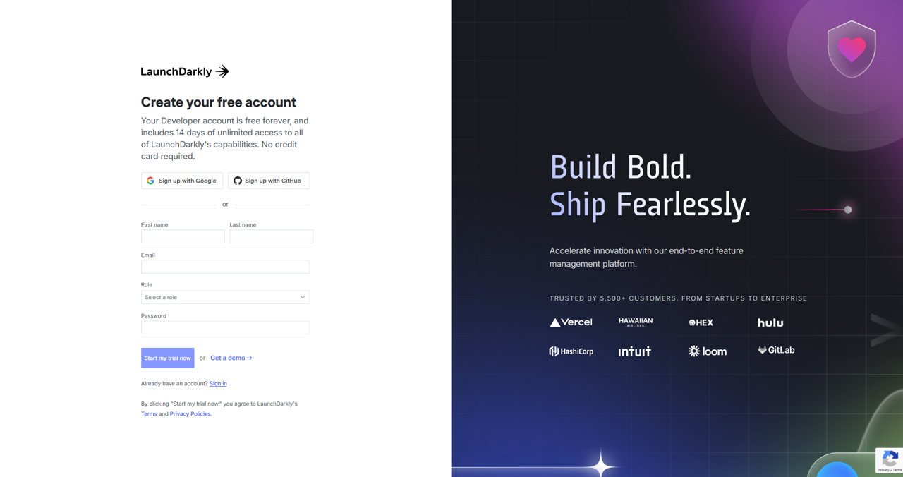

   * Create a new project specifically for the three scenarios, naming it to reflect its purpose.

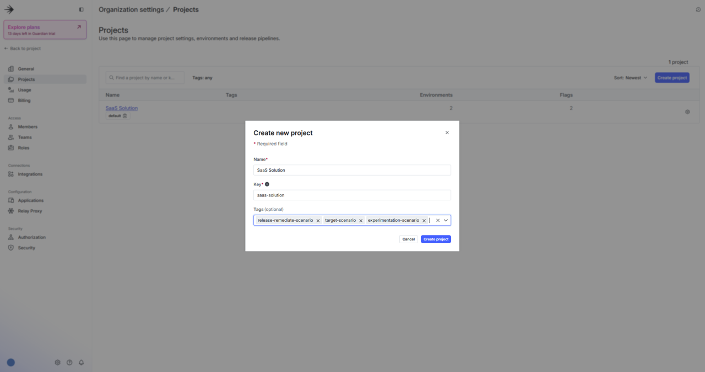

2. **Create Feature Flags**

   * Navigate to your project and create the following feature flags:

     * `new-feature`:

       * Used in the **Release/Remediate** scenario.

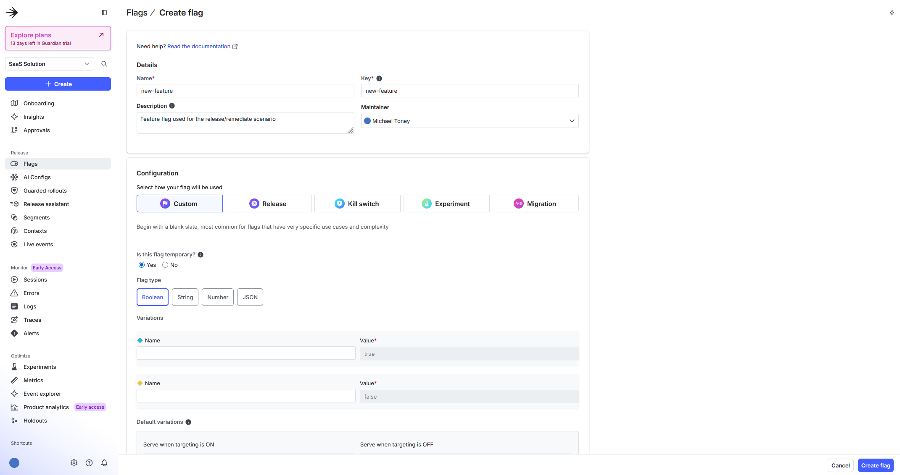

       * [LaunchDarkly Docs: Creating Feature Flags](https://launchdarkly.com/docs/home/flags/create)
     * `landing-page-banner`:

       * Used in the **Target** and **Experimentation** scenarios. Proceed to step 3 for configuration details.

3. **Configure Targeting Rules and Segments**

   * Set up context-based targeting:

     * Go to the feature flag `landing-page-banner`.
     * Configure individual or rule-based targeting using context attributes such as `region`, `subscription`, and `email`.

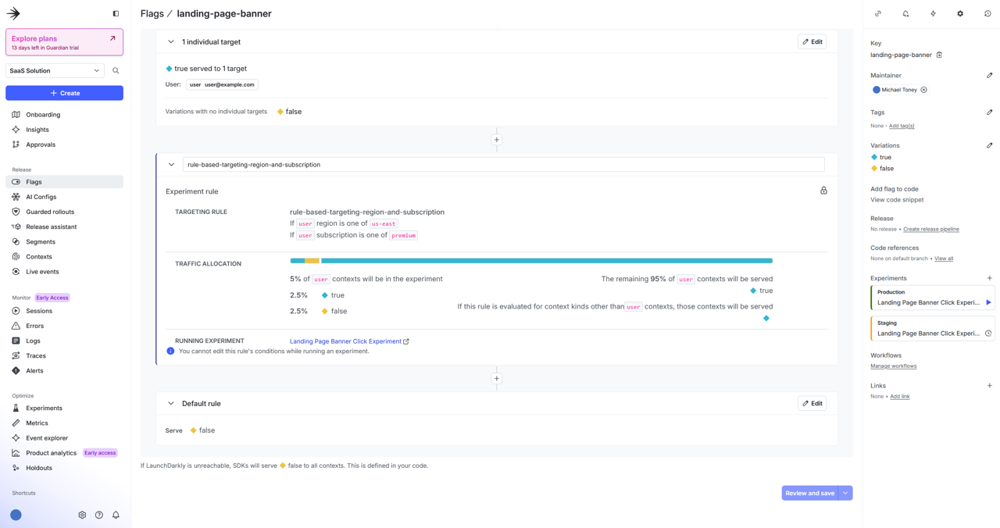

   * Refer to the following documentation for detailed guidance:

     * [LaunchDarkly Docs: Targets](https://launchdarkly.com/docs/home/flags/target)
     * [LaunchDarkly Docs: Segments](https://launchdarkly.com/docs/home/flags/segments)

4. **Experimentation Setup**

   * Define a metric for measuring user interaction, such as "banner clicks".

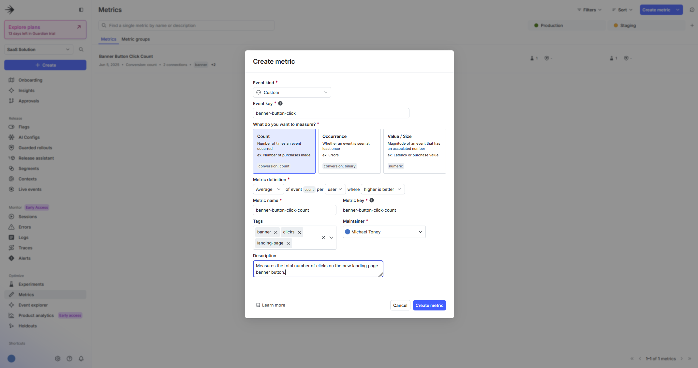

   * [LaunchDarkly Docs: Metrics](https://launchdarkly.com/docs/home/metrics).
   * Create an experiment using the `landing-page-banner` feature flag and the defined metric to measure its impact.

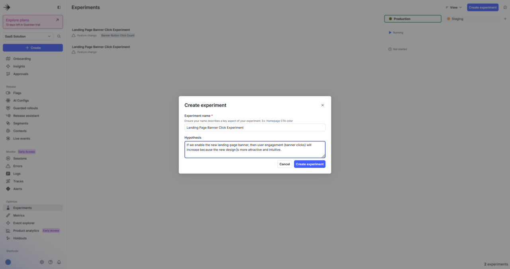
   
   * Configure the following experiment parameters (illustrated in the next three diagrams):
     * Feature change experiment type
     * Randomized by user
     * Banner Button Click Count metric
     * landing-page-banner flag
     * 5% sample size
     * 95% Bayesian threshold

   **Diagram 1**
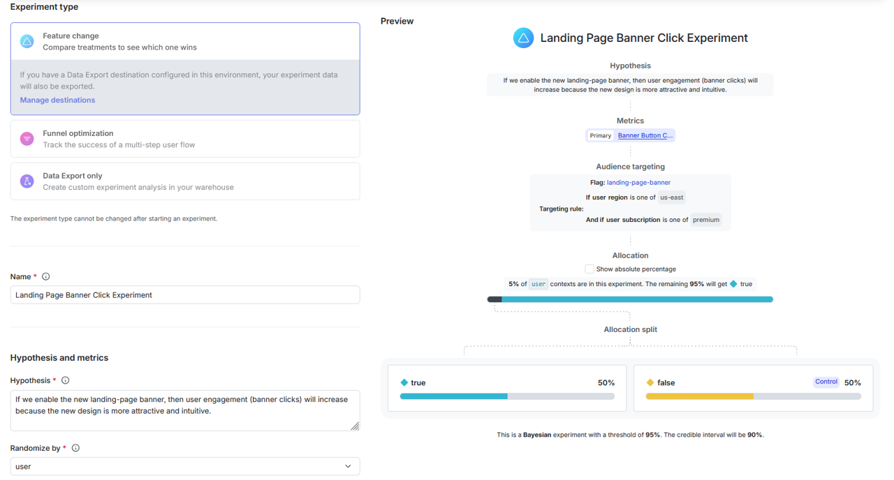

   **Diagram 2**
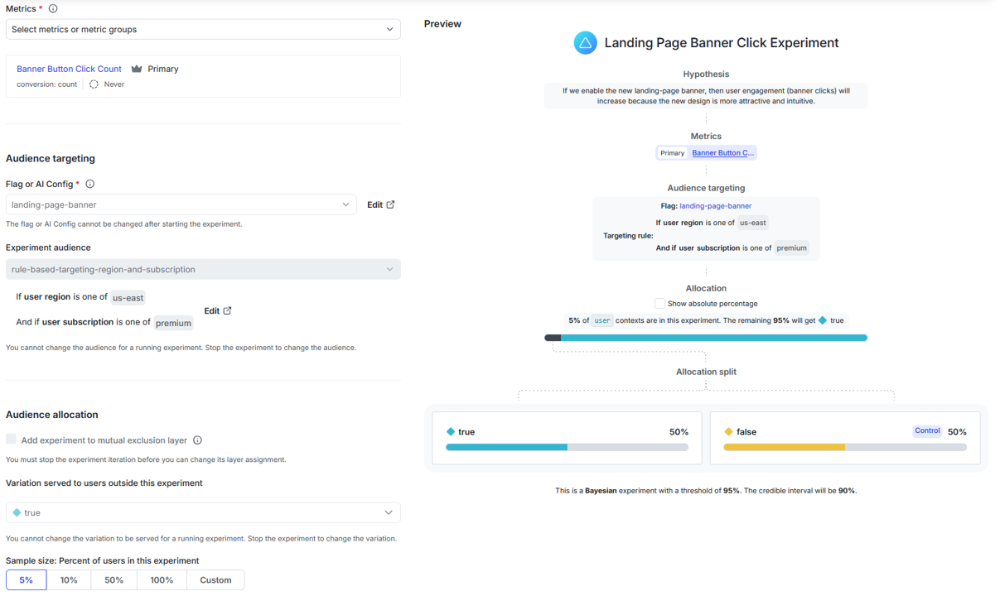

   **Diagram 3**
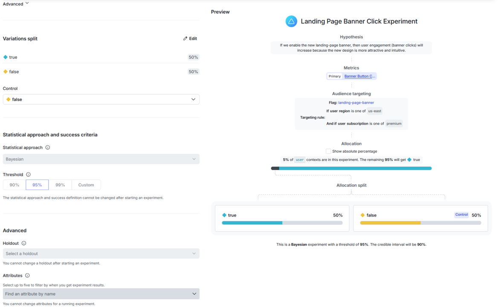

   * [LaunchDarkly Docs: Experimentation](https://launchdarkly.com/docs/home/experimentation).


After completing installation steps 1 and 2, your environment is set up and ready for running the application.

---

## Running the Application

To run and interact with the Flask application locally, follow these steps:

  1. **Activate your virtual environment (if applicable):**

  ```
  source venv/bin/activate  # On Windows: venv\Scripts\activate
  ```

  2. **Start the Flask application:**

  ```
  python saas-app.py
  ```

Your application will be accessible through your web browser at:

  ```
  http://127.0.0.1:5000
  ```

Open this URL in your web browser to access the application.

---

### Application Use

After launching the application, use the following guidelines to navigate and interact with the provided scenarios via the web interface:

  **Home (index.html): Landing page** 
   * Displays the landing page.
   * Use the sidebar menu to select scenarios.

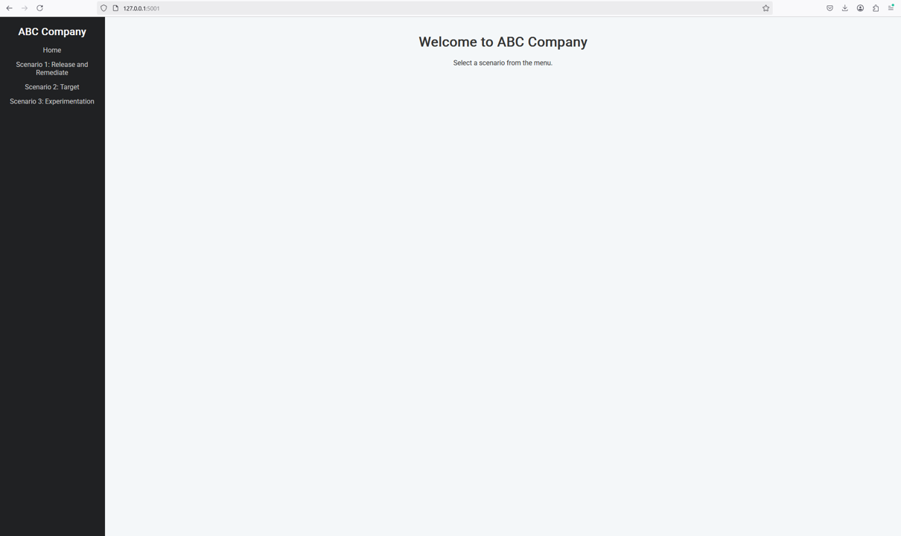

  **Scenario 1: Release and Remediate (scenario1.html)**
   * Toggle a feature flag on or off using the provided button in the Web UI, or login to your LaunchDarkly account, navigate to Flags, and toggle the flag on or off.
   * Instantly view the status of the feature without needing a page reload.
   * If the feature is enabled, upload a file using the provided upload interface, which confirms successful uploads. When the feature is disabled, the upload feature will be unavailable.

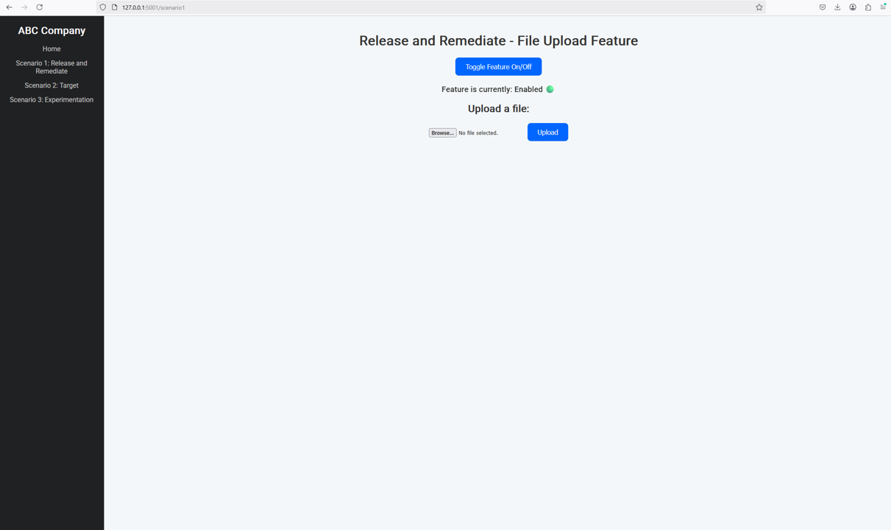

  **Scenario 2: Target (scenario2.html)**
   * Enter user-specific attributes (email, region, subscription) along with a filename to request targeted content. See logic below:
     * If the feature flag is enabled, the content will be displayed. If the feature flag is disabled, the content will not be displayed.
     * If the user email matches the email in the targeted flag, the content will be displayed. If not, the content will not be displayed.
     * If the user region and subscription matches the region and subscription in the targeted flag, the content will be displayed. If not, the content will not be displayed.
   * Dynamically initiate file download based on targeted feature flag rules.
   * Receive clear status messages confirming successful initiation or detailing errors.


  **Scenario 3: Experimentation (scenario3.html)**
   * Submit simulated user interactions through a form (email, region, subscription).
   * Track these interactions to measure the effectiveness of a feature experiment.
   * Receive immediate confirmation of event tracking.

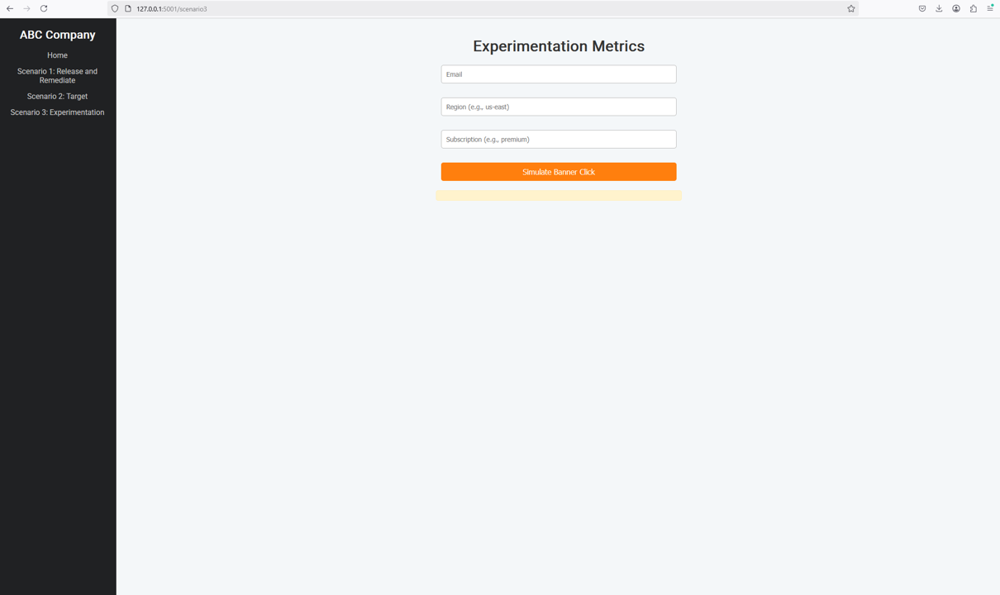

---

### Stopping the Application

Stop the Flask development server by pressing:

  ```
  Ctrl+C
  ```
in your terminal.

---

## Continuous Integration (CI)

This project leverages GitHub Actions to automate testing and ensure code reliability and quality upon each push or pull request.

### CI Workflow

The CI pipeline performs the following actions:
  * **Environment Setup**: Configures a Python 3.11 runtime environment.
  * **Dependency Installation**: Installs required Python libraries from `requirements.txt`.
  * **Testing**: Executes automated tests using the pytest framework to verify functionality across all application scenarios.

The configuration for this workflow is defined in .github/workflows/python-ci.yml. CI results and test statuses can be viewed in the "Actions" tab on your GitHub repository.

---

## Testing
The application includes automated tests managed via GitHub Actions. These tests validate the integration of LaunchDarkly feature flags with the Flask application across all defined scenarios:

  * **Scenario 1**: Tests feature flag toggling and file upload functionality.
  * **Scenario 2**: Validates targeted file download based on user attributes and feature flags.
  * **Scenario 3**: Confirms event tracking and interaction handling for experimentation purposes.

### Automated Testing Workflow
The automated tests execute automatically upon every code push or pull request. The GitHub Actions workflow performs:

  * Python environment setup.
  * Installation of dependencies.
  * Execution of pytest-based tests (tests/test_app.py).

The workflow is configured in .github/workflows/python-ci.yml, ensuring consistent and reliable test execution.

---

## Best Practices
To ensure optimal use and maintenance of the application, adhere to these best practices:

  * **Secure Management**: Always manage sensitive data like LaunchDarkly SDK keys and API tokens using environment variables and .env files. Never commit these to version control.
  * **Clear Flag Naming**: Use descriptive and consistent naming conventions for feature flags to enhance clarity and ease of management.
  * **Regular Testing**: Continuously monitor and regularly test feature flags to verify expected behavior and swiftly identify potential issues.
  * **Comprehensive Logging**: Implement detailed logging and error handling practices to facilitate troubleshooting, monitoring, and efficient operational management.
  * **Documentation Maintenance**: Regularly update the application documentation to accurately reflect changes in setup, configurations, or usage instructions.

---

## Additional Resources
Enhance your understanding and usage of LaunchDarkly and Flask by exploring these resources:

  * [LaunchDarkly Docs](https://docs.launchdarkly.com/): Comprehensive documentation for LaunchDarkly features and functionalities.
  * [Flask Documentation](https://flask.palletsprojects.com/en/stable/): Official documentation for the Flask web framework.

---

## Support

For any issues, questions, or suggestions related to this application, please open an issue in the project's GitHub repository. Your feedback helps improve the quality and usability of this application.
