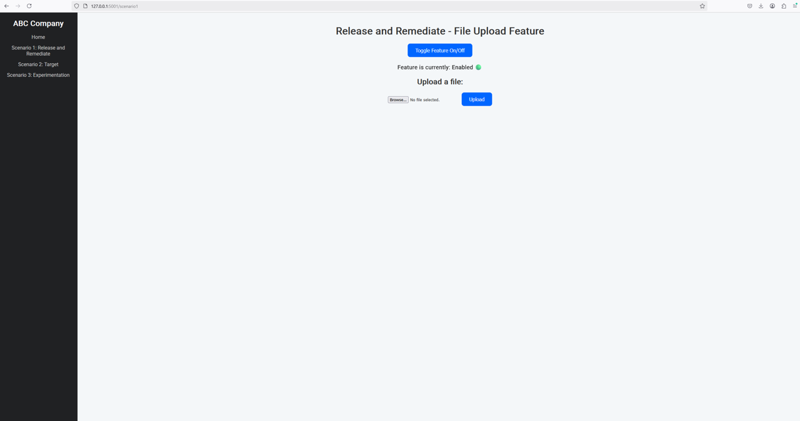
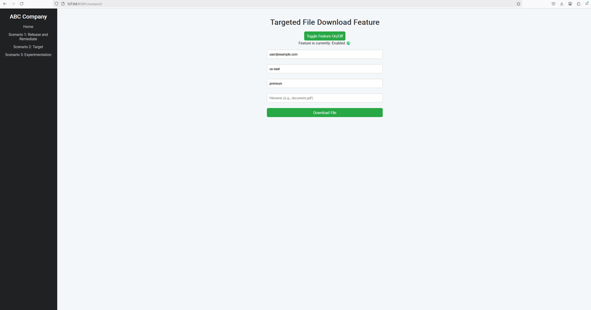
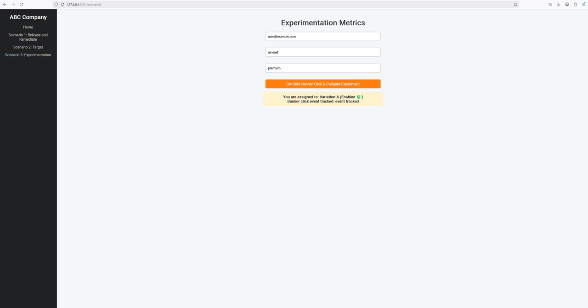

# LaunchDarkly Sample App

This sample application demonstrates the use of LaunchDarkly feature flags in Python using Flask. It covers three key scenarios: **Release/Remediate**, **Target**, and **Experimentation**.

## Scenarios Covered

* **Release/Remediate**: Quickly release and roll back a feature flag.
* **Target**: Demonstrate feature targeting based on user context attributes.
* **Experimentation**: Track user interactions to measure feature impact.

---

## Continuous Integration (CI)
This repository uses GitHub Actions for Continuous Integration, automatically running pytest-based tests on each push or pull request to ensure code quality and stability.

**CI Workflow:**
* Sets up Python 3.11 environment
* Installs project dependencies
* Executes tests located in the tests/ directory

You can view the test results and status under the Actions tab on the GitHub repository.

## Prerequisites

* Python 3.8 or higher
* Flask
* LaunchDarkly Server-Side SDK for Python

## Installation

1. **Clone this repository**:

   ```bash
   git clone https://github.com/SaigMike/LaunchDarkly.git
   cd LaunchDarkly
   ```

2. **Install dependencies**:

   ```bash
   pip install flask launchdarkly-server-sdk python-dotenv pytest
   ```

---

## Configuration

### Local Environment Setup

Create a `.env` file at the project root and securely set your LaunchDarkly SDK key:

```bash
LD_SDK_KEY=your-sdk-key-here
```

Replace `your-sdk-key-here` with your actual LaunchDarkly SDK key.

### LaunchDarkly Website Configuration

Complete the following detailed steps to configure LaunchDarkly to work with this application:

1. **Create a LaunchDarkly Account and Project**

   * Sign up at [LaunchDarkly](https://app.launchdarkly.com/signup/) if you don't already have an account.

   

   * Create a new project specifically for the three scenarios, naming it to reflect its purpose.

   

2. **Create Feature Flags**

   * Navigate to your project and create the following feature flags:

     * `new-feature`:

       * Used in the **Release/Remediate** scenario.

       

       * [LaunchDarkly Docs: Creating Feature Flags](https://launchdarkly.com/docs/home/flags/create)
     * `landing-page-banner`:

       * Used in the **Target** and **Experimentation** scenarios. Proceed to step 3 for configuration details.

3. **Configure Targeting Rules and Segments**

   * Set up context-based targeting:

     * Go to the feature flag `landing-page-banner`.
     * Configure individual or rule-based targeting using context attributes such as `region`, `subscription`, and `email`.

     

     * Refer to the following documentation for detailed guidance:

       * [LaunchDarkly Docs: Targets](https://launchdarkly.com/docs/home/flags/target)
       * [LaunchDarkly Docs: Segments](https://launchdarkly.com/docs/home/flags/segments)

4. **Experimentation Setup**

   * Define a metric for measuring user interaction, such as "banner clicks".

   

   * [LaunchDarkly Docs: Metrics](https://launchdarkly.com/docs/home/metrics).
   * Create an experiment using the `landing-page-banner` feature flag and the defined metric to measure its impact.

   
   
   * Configure the following experiment parameters (illustrated in the next three diagrams):
     * Feature change experiment type
     * Randomized by user
     * Banner Button Click Count metric
     * landing-page-banner flag
     * 5% sample size
     * 95% Bayesian threshold

   **Diagram 1**
   

   **Diagram 2**
   

   **Diagram 3**
   

     * [LaunchDarkly Docs: Experimentation](https://launchdarkly.com/docs/home/experimentation).

---

## Application Use

To run and interact with the Flask application locally, follow these steps:

### Starting the Application

Before starting, ensure you've configured your LaunchDarkly SDK key in the .env file.

Launch the Flask app by executing:

```
python saas-app.py
```

Your application will be accessible through your web browser at:

```
http://127.0.0.1:5000
```

### Navigating the Web UI

After starting the app, use the sidebar menu within the web interface to navigate and interact with each scenario:

  * **Home (index.html): Landing page** 
    * Displays the landing page with general instructions and links to each scenario.

    

  * **Scenario 1: Release and Remediate (scenario1.html)**
    * Accessible via the sidebar menu: Scenario 1: Release and Remediate
    * Provides a button to dynamically check whether the feature is on or off without requiring a page reload.

    

  * **Scenario 2: Targeting (scenario2.html)**
    * Accessible via the sidebar menu: Scenario 2: Target
    * Contains a form for inputting user attributes (email, region, subscription).
    * Upon submission, dynamically displays content based on targeted feature flag responses.

    

  * **Scenario 3: Experimentation (scenario3.html)**
    * Accessible via the sidebar menu: Scenario 3: Experimentation
    * Offers a form to simulate user interactions (such as banner clicks).
    * Tracks and confirms event interactions for measuring feature experimentation.

    

### Stopping the Application

Stop the Flask development server by pressing:
```
Ctrl+C
```
in your terminal.


---

## Project Structure

```
.
├─ .env                  # Contains sensitive environment variables (not committed)
├─ .git                  # Git repository metadata
├─ .github               # GitHub Actions workflows
│  └─ workflows
│     └─ python-ci.yml   # GitHub Actions workflow for CI/CD
├─ .gitignore            # Specifies files and directories to be ignored by Git
├─ images                # Contains images used in the documentation
├─ README.md             # Documentation
├─ requirements.txt      # Python dependencies
├─ saas-app.py           # Flask application with LaunchDarkly integration
├─ static                # Static assets (CSS, images, JavaScript)
│  ├─ css
│  │  └─ saas-app.css    # CSS styles for the application
│  ├─ images
│  └─ js
├─ templates
│  ├─ base.html           # Base template for HTML pages
│  ├─ index.html          # Homepage template
│  ├─ menu.html           # Navigation menu template
│  ├─ scenario1.html      # Scenario 1 template
│  ├─ scenario2.html      # Scenario 2 template
│  └─ scenario3.html      # Scenario 3 template
├─ tests
   └─ test_app.py        # Unit tests for the Flask application
```
---

## Testing

The application includes automated tests managed through GitHub Actions workflows. These tests ensure that the Flask application's integration with LaunchDarkly feature flags works correctly across all scenarios:

- **Scenario 1:** Release and Remediate  
- **Scenario 2:** Targeting  
- **Scenario 3:** Experimentation  

### Automated Testing with GitHub Actions

Automated tests run each time you push changes or open a pull request. The Continuous Integration (CI) workflow automatically:

- Sets up a Python 3.11 environment.
- Installs dependencies from `requirements.txt`.
- Executes tests defined in `tests/test_app.py`.

### GitHub Actions Workflow Configuration

The workflow configuration is defined in `.github/workflows/python-ci.yml`:

```yaml
jobs:
  build:
    runs-on: ubuntu-latest
    steps:
      - uses: actions/checkout@v4
      - name: Set up Python 3.11
        uses: actions/setup-python@v5
        with:
          python-version: "3.11"
      - name: Install dependencies
        run: |
          python -m pip install --upgrade pip
          pip install -r requirements.txt
      - name: Run tests with pytest
        run: |
          pytest tests/test_app.py
```
---

## Best Practices

* Use environment variables to securely manage sensitive information like SDK keys.
* Ensure feature flags are appropriately named and maintained in LaunchDarkly.
* Regularly monitor and test feature flags for expected behavior.
* Utilize detailed logging and error handling to simplify debugging and operations.

---

## Additional Resources

* [LaunchDarkly Docs](https://docs.launchdarkly.com/)
* [Flask Documentation](https://flask.palletsprojects.com/en/stable/)

---

## Support

For issues or further assistance, please open an issue on this repository.
